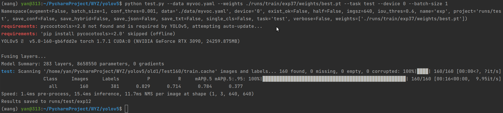

# Detecting Occluded and Dense Trees in Urban Terrestrial Views with a High-quality Tree Detection Dataset (TGRS'2022)

Authors: Yongzhen Wang, Xuefeng Yan, Hexiang Bao, Yiping Chen, Lina Gong, Mingqiang Wei and Jonathan Li

[[Paper Link]](https://ieeexplore.ieee.org/document/9800966) 

### Abstract

Urban trees are often densely planted along the two sides of a street. When observing these trees from a fixed view, they are inevitably occluded with each other and the passing vehicles. The high density and occlusion of urban tree scenes significantly degrade the performance of object detectors. This paper raises an intriguing learning-related question -- if a module is developed to enable the network to adaptively cope with occluded and un-occluded regions while enhancing its feature extraction capabilities, can the performance of a cutting-edge detection model be improved?
To answer it, a lightweight yet effective object detection network is proposed for discerning occluded and dense urban trees, called OD-UTDNet. The main contribution is a newly-designed Dilated Attention Cross Stage Partial (DACSP) module. DACSP can expand the fields-of-view of OD-UTDNet for paying more attention to the un-occluded region, while enhancing the network's feature extraction ability in the occluded region. This work further explores both the self-calibrated convolution module and GFocal loss, which enhance the OD-UTDNet's ability to resolve the challenging problem of high densities and occlusions.
Finally, to facilitate the detection task of urban trees, a high-quality urban tree detection dataset is established, named UTD; to our knowledge, this is the first time. Extensive experiments show clear improvements of the proposed OD-UTDNet over twelve representative object detectors on UTD. The code and dataset are available at https://github.com/yz-wang/OD-UTDNet.

#### If you find the resource useful, please cite the following :- )

```
@article{Wang_2022_TGRS,
author={Wang, Yongzhen and Yan, Xuefeng and Bao, Hexiang and Chen, Yiping and Gong, Lina and Wei, Mingqiang and Li, Jonathan},
  journal={IEEE Transactions on Geoscience and Remote Sensing}, 
  title={Detecting Occluded and Dense Trees in Urban Terrestrial Views with a High-quality Tree Detection Dataset}, 
  year={2022},
  volume={60},
  number={},
  pages={1-12},
  doi={10.1109/TGRS.2022.3184300}}
}
```  

## Prerequisites
Python 3.6 or above.

For packages, see requirements.txt.

### Getting started


- Install PyTorch 1.6 or above and other dependencies (e.g., torchvision, visdom, dominate, gputil).

  For pip users, please type the command `pip install -r requirements.txt`.
  
  
## UTD Dataset

- Our UTD dataset is available at:
1. Baidu Netdisk: https://pan.baidu.com/s/1TSY340mG2UvPNbbQh5MkbQ           
Code: xs7t

2. Google Drive: https://drive.google.com/file/d/1BELIyg2YlE2JLIdEMz8M4if9gMZoPTRm/view?usp=sharing

- You should first convert the images and annotations to YOLO labels.
  
## OD-UTDNet Training and Test

- Train the OD-UTDNet model:
```bash
python train.py --data myvoc.yaml --cfg yolov5s.yaml --weights '' --batch-size 32 --epochs 100
```
The checkpoints will be stored at `./runs/train/exp`.

- Test the OD-UTDNet model (Calculate AP/mAP metrics):
```bash
python test.py --data myvoc.yaml --weights ./runs/train/exp/weights/best.pt --task test --device 0 --batch-size 1
```
The test results will be saved to an html file here: `./runs/test/exp`.

- Detect the Tree images (Output detecting images):
```bash
python detect.py --source ./Tree/Test160/images --weights ./runs/train/exp/weights/best.pt --conf 0.5
```
The detect results will be saved to an html file here: `./runs/detect/exp`.

## Detection Results
UTD test set:



## Acknowledgments
Our code is developed based on [pytorch-YOLOv5](https://github.com/ultralytics/yolov5/tree/v4.0). We thank the awesome work provided by YOLOv5.
And great thanks to the anonymous reviewers for their helpful feedback.

## Contact

If you have questions, you can contact `wangyz@nuaa.edu.cn`.

